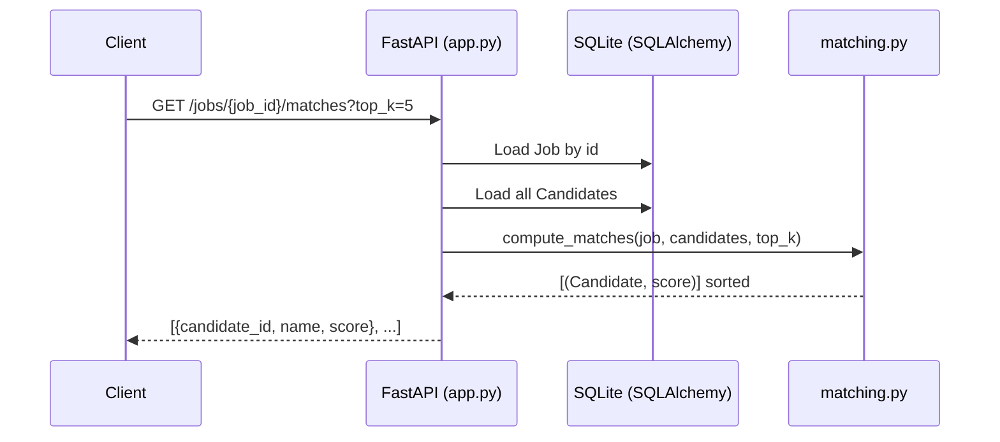

# Codebase Learning Guide

This repository contains a small FastAPI microservice that stores Job postings and Candidate profiles in SQLite and returns top-K matches using TF‑IDF + cosine similarity.

## Quick Start (for orientation)

- Run locally: `uvicorn app:app --reload --host 0.0.0.0 --port 8000`
- API docs: `http://localhost:8000/docs`
- SQLite DB file: `candidate_matching.db` (created on first startup)

## Mental Model

There are three concerns, each kept in its own module:

- **HTTP layer** (`app.py`): request routing, validation (via Pydantic schemas), error mapping.
- **Persistence layer** (`models.py`, `crud.py`): SQLAlchemy models + DB session + CRUD helpers.
- **Matching layer** (`matching.py`): converts text to vectors and computes similarity scores.

The matching endpoint ties them together:

1. `GET /jobs/{job_id}/matches` loads the job and all candidates from SQLite.
2. `matching.compute_matches(...)` calculates similarity scores.
3. The endpoint returns `{candidate_id, name, score}` for the top `K`.

## Project Map

- `app.py`: FastAPI app, endpoints, startup DB init (`init_db()`), dependency injection (`get_db()`).
- `schemas.py`: Pydantic v2 request/response schemas (used as FastAPI `response_model`s).
- `models.py`: SQLAlchemy declarative models (`Job`, `Candidate`), engine/session setup, DB init.
- `crud.py`: small CRUD helper functions (create/get/list) for jobs and candidates.
- `matching.py`: TF‑IDF vectorization, cosine similarity, top‑K ranking.

## Data Model & Persistence

### Tables

- `jobs`: `id` (UUID string), `title`, `description`, `requirements` (nullable)
- `candidates`: `id` (UUID string), `name`, `skills`, `summary` (nullable)

IDs are generated in `models.generate_uuid()` and used as SQLAlchemy defaults.

### Database lifecycle

- The database URL is `sqlite:///./candidate_matching.db` in `models.py`.
- Tables are created on app startup via `app.py` → `startup_event()` → `models.init_db()`.
- Each request gets a SQLAlchemy `Session` from `models.get_db()` (FastAPI dependency).

To reset locally during development, stop the server and delete `candidate_matching.db`.

## Request/Response Validation

Schemas live in `schemas.py`:

- Create requests: `JobCreate`, `CandidateCreate` (basic non-empty validation via `Field(..., min_length=1)`).
- Responses: `JobResponse`, `CandidateResponse` use `Config.from_attributes = True` so SQLAlchemy model instances serialize cleanly.
- Matching response: `MatchResult` (`candidate_id`, `name`, `score`).

## Matching Logic (TF‑IDF)

Text concatenation rules:

- Job text: `title + description + requirements` (if present) in `matching.get_job_text()`.
- Candidate text: `skills + summary` (if present) in `matching.get_candidate_text()`.

Algorithm for a match request (`matching.compute_matches()`):

1. Build `all_texts = [job_text] + candidate_texts`.
2. Fit a fresh `TfidfVectorizer(stop_words="english", lowercase=True)` on `all_texts`.
3. Compute cosine similarity between the job vector and each candidate vector.
4. Sort descending, return top `K`.

Notes:

- Because the vectorizer is fit per request, scores are only comparable within the same request (which is fine for “top‑K for this job”).
- `skills` is treated as plain text; if you later store structured skills, you’ll need to decide how to convert them to text consistently.

## End-to-End Flow (Matches)

## Common Change Recipes

### Add a field to `Job` or `Candidate`

1. Update the SQLAlchemy model in `models.py`.
2. Update request/response schemas in `schemas.py`.
3. Update `crud.py` create functions to persist the new field.
4. Decide how (or if) it participates in matching by updating `matching.get_job_text()` / `matching.get_candidate_text()`.

Because this project uses SQLite without migrations, existing local DB files won’t automatically pick up schema changes; recreate `candidate_matching.db` for local development.

### Add a new endpoint

1. Add a Pydantic schema in `schemas.py` (if you need structured input/output).
2. Add a CRUD function in `crud.py` (if it touches the DB).
3. Add the route in `app.py` using `Depends(get_db)` for DB access.

## Debugging & Troubleshooting

- **“Job not found” / “Candidate not found”**: the service returns `404` from `app.py` when `crud.get_job/get_candidate` returns `None`.
- **SQLite file location**: `candidate_matching.db` is relative to the process working directory; run the server from the repo root to keep it predictable.
- **Empty matches list**: if there are no candidates, `GET /jobs/{job_id}/matches` returns `[]`.
- **Repro quickly**: use the `curl` examples in `README.md`.

